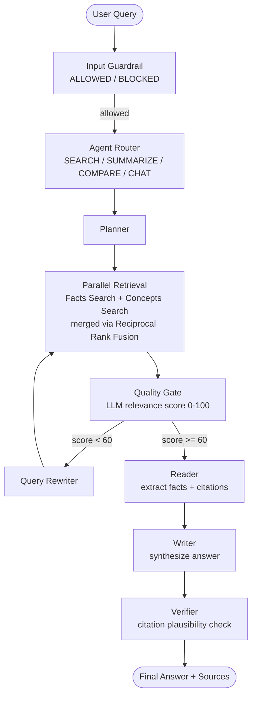
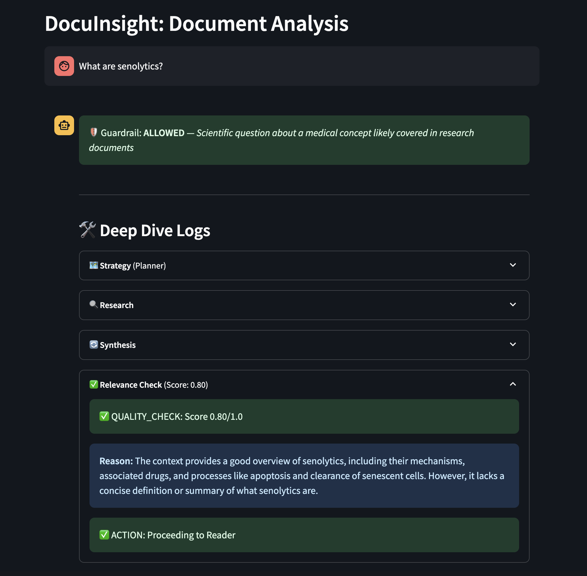

# DocuInsight — Multi-Agent RAG with Self-Correction

> A production-oriented RAG architecture demonstrating LangGraph orchestration,
> parallel retrieval, quality-gated self-correction, and provider-agnostic LLM integration.


---

## Problem Statement

Standard RAG pipelines retrieve documents and generate an answer in a single pass.
This works for simple queries but fails silently when retrieved context is incomplete,
when the question requires synthesis across documents, or when the model hallucinates
unsupported claims.

DocuInsight addresses this with a multi-agent loop: a **Quality Gate** scores retrieval
relevance, triggers a **Smart Retry** with a rewritten query if needed, and a
**Verifier** checks citations before the answer reaches the user.

---

## Why I Built This

I have professional experience building enterprise RAG on Azure
(AI Search, OpenAI Service, Functions) – end-to-end from architecture
to production rollout. DocuInsight is the open-source counterpart:
same multi-agent pipeline, same self-correction logic, but fully local
with ChromaDB and OpenAI/Ollama – no cloud dependencies, no vendor lock-in.

The evaluation section below compares both systems on the same testset.

---

## Pipeline Flow



### Glass Box Developer Mode



*Deep Dive Logs expose the full agent trace: guardrail decisions, retrieval strategy, quality scoring with reasoning, and source extraction – all visible per query.*

---

## Key Features

- **Hybrid retrieval (Vector + BM25)** — **Every query runs both ChromaDB vector similarity and BM25 keyword matching**; results are merged via Reciprocal Rank Fusion (RRF). This matches the hybrid search strategy of Azure AI Search, but runs fully local.
- **Parallel dual-track retrieval** — Facts query and Concepts query run simultaneously via LangGraph's parallel node execution; results are merged before the Quality Gate.
- **Parent-chunk expansion** — **Retrieval matches small chunks for precision, then loads the full parent page for context.** Deduplication ensures each parent page appears only once, even when multiple child chunks from the same page are matched.
- **Hybrid Map-Reduce Reader** — **Small contexts use a single LLM call; large contexts are split and processed in parallel, then merged.** This prevents token-limit issues with long documents while preserving cross-document reasoning for shorter ones.
- **Quality Gate** — **An LLM scores the full retrieved context for relevance (0–100) before the Reader processes it.** Early versions only checked the first 2–3k characters — the current version evaluates the complete context to catch partial misses.
- **Self-correcting loop** — If the Quality Gate scores below 60, the agent rewrites the query and retries automatically (max 2 retries, configurable).
- **LLM-as-Judge evaluation** — `evaluate.py` runs a testset against the live system and scores each answer using GPT-4o as an independent judge. Parallel `ThreadPoolExecutor` reduces eval time by ~75%.
- **Entity-aware COMPARE** — **For comparison queries referencing authors by name, the system extracts entities via LLM and searches document first pages for matches** (word-boundary matching for short names), loading matched documents in full — compensating for pure vector search's weakness with proper nouns.
- **Provider-agnostic LLM** — Switch between OpenAI API and local Ollama with a single env variable. No code changes required.
- **Multimodal ingest** — `ingest.py` extracts text chunks and images from PDFs; diagrams are analysed with GPT-4o Vision and stored as text descriptions alongside regular chunks.
- **Cross-lingual retrieval** — **Queries in German work against an English corpus.** The system detects query language, expands with translated synonyms, and merges results via cross-lingual RRF. The Writer responds in the query language regardless of document language.
- **Writer reflection loop** — **The Writer produces a draft, a Critic agent fact-checks it, and the Writer revises.** Reduces hallucinations by catching unsupported claims before the final answer.
- **Cross-encoder reranking** — After hybrid retrieval (BM25 + vector), a cross-encoder model (ms-marco-MiniLM) re-scores the top candidates for semantic relevance. Improved Healthcare score by +8.1 points.
- **Conversational memory** — **Follow-up questions like "Explain point 2 in more detail" work without repeating context.** LangGraph MemorySaver maintains conversation state per session, and the Planner rewrites follow-up queries into standalone search queries.
- **Glass Box developer mode** — Streamlit sidebar toggle exposes the full agent trace: query optimisation reasoning, retrieved chunks, quality scores, and verifier output.
- **LangGraph Studio integration** — `langgraph dev` launches a visual graph debugger; step through nodes and inspect state at every edge.

---

## Quick Start

```bash
# 1. Install
pip install -e .          # editable install — adds src/ to PYTHONPATH
pip install -e ".[ml]"    # optional: cross-encoder reranking

# 2. Configure provider
cp .env.example .env
# Set LLM_PROVIDER=openai + OPENAI_API_KEY, or LLM_PROVIDER=ollama

# 3. Ingest documents
cp your-documents.pdf input/
python src/ingest.py

# 4. Run
streamlit run src/app.py
```

---

## LLM Provider Switch

DocuInsight abstracts the LLM client behind a factory (`src/llm_provider.py`).
Set `LLM_PROVIDER` in `.env` — no other changes needed:

```env
# OpenAI (default)
LLM_PROVIDER=openai
OPENAI_API_KEY=your-api-key-here
LLM_MODEL=gpt-4o-mini
VISION_MODEL=gpt-4o
EMBEDDING_MODEL=text-embedding-3-small

# Ollama — fully local, no API key, air-gap capable
LLM_PROVIDER=ollama
OLLAMA_BASE_URL=http://localhost:11434/v1
OLLAMA_MODEL=llama3.1
```

Ollama uses the same OpenAI-compatible API — no additional SDK required.
Pull a model with `ollama pull llama3.1` and the system is fully offline.

> **Note:** Image analysis during PDF ingestion requires the Vision API (`VISION_MODEL=gpt-4o`) and is only available with `LLM_PROVIDER=openai`. When using Ollama, images in PDFs are silently skipped — text extraction works normally.

---

## Design Decisions & Trade-offs

| Decision | This Repo (Local MVP) | Production Reference |
|---|---|---|
| **Vector Store** | ChromaDB — zero setup, file-based persistence | Azure AI Search — hybrid BM25+vector, managed |
| **LLM** | OpenAI API or Ollama (switchable) | Azure OpenAI — private endpoint, no data egress |
| **Embeddings** | `text-embedding-3-small` via API | Azure OpenAI embeddings deployment |
| **Auth** | None | Azure AD — basic access control |
| **Monitoring** | Glass Box UI + console logs | Azure Application Insights |
| **Deployment** | `streamlit run` | Azure Container Apps / Functions (serverless) |
| **Evaluation** | GPT-4o Judge, local testset | Dedicated eval pipeline, human-in-the-loop review |

The local MVP is intentionally simple to set up. The trade-off table shows where
each component would be replaced in a regulated or enterprise deployment
(e.g. healthcare data under GDPR, financial services).

---

## Project Structure

```
docuinsight-rag/
├── src/
│   ├── llm_provider.py      # Provider factory (OpenAI / Ollama)
│   ├── agent_graph.py       # LangGraph StateGraph — full pipeline
│   ├── advanced_agent.py    # Reader → Writer → Verifier
│   ├── agent_core.py        # Intent router (4 intents)
│   ├── guardrail.py         # Input filter (ALLOWED / BLOCKED)
│   ├── retriever.py         # ChromaDB retrieval + parent expansion
│   ├── ingest.py            # PDF → chunks + Vision → ChromaDB
│   ├── evaluate.py          # LLM-as-Judge evaluation harness
│   ├── app.py               # Streamlit UI with Glass Box mode
│   ├── console_chat.py      # Terminal chat interface
│   └── discovery.py         # Night Shift — autonomous batch analysis
├── tests/
│   ├── test_phase0.py       # Smoke tests (ingest + retrieval)
│   ├── test_phase1.py       # Provider abstraction tests
│   ├── test_phase2.py       # Domain data + ChromaDB tests
│   └── test_phase3.py       # README quality + secrets scan
├── scripts/
│   └── generate_healthcare_pdfs.py  # Demo document generator
├── data/
│   └── testset.json         # Evaluation cases with reference_truth
├── input/                   # Drop PDFs here (gitignored)
├── .env.example             # Configuration template
├── langgraph.json           # LangGraph Studio entry point
└── pyproject.toml
```

---

## Why Build from Scratch?

Off-the-shelf RAG platforms and frameworks solve retrieval out of the box — but hide the decisions that matter in production: how retrieval is scored, when to retry, and why a query gets blocked. DocuInsight was built from scratch to keep every architectural decision visible and tuneable.

---

## Evaluation

Run the full evaluation against the live system:

```bash
python src/evaluate.py                              # default healthcare testset
python src/evaluate.py --testset data/testset_bio.json  # scientific papers testset
```

Each test case defines a `question`, `reference_truth`, `must_contain` keywords,
and an `intent`. The system runs each question through the full agent pipeline
and scores the answer with GPT-4o as an independent judge.

**Evaluation methodology:**
- **Reference truth:** The `reference_truth` for each test case was curated using Google NotebookLM on the source PDFs to establish a verified baseline.
- **Scoring (0–100):** An independent LLM-as-a-Judge node (GPT-4o) scores each generated answer against this baseline, penalizing hallucinations, missing citations, and incomplete synthesis.
- **Reproducibility:** The testset (`data/testset.json`) ships with the repo. Download the papers listed below, run `ingest.py`, then `evaluate.py`.

### Test Documents

**Why biomedical papers?** I deliberately chose a highly complex, dense domain to stress-test the system. Simple documents don't require self-correction loops; dense scientific papers expose the true limits of standard RAG pipelines.

The biotech testset uses these open-access papers (not included in the repo – download and place in `input/`):

| # | Authors | Title | Link |
|---|---------|-------|------|
| 1 | Lopez-Otin et al. 2023 | Hallmarks of aging: An expanding universe | [Cell](https://doi.org/10.1016/j.cell.2022.11.001) |
| 2 | Tartiere et al. 2024 | The hallmarks of aging as a conceptual framework | [Frontiers in Aging](https://doi.org/10.3389/fragi.2024.1334261) |
| 3 | Chen et al. 2025 | Immunosenescence in aging and neurodegenerative diseases | [Translational Neurodegeneration](https://doi.org/10.1186/s40035-025-00517-1) |
| 4 | Li et al. 2023 | Interactions between mitochondrial dysfunction and other hallmarks | [Aging Cell](https://doi.org/10.1111/acel.13942) |
| 5 | Kaeberlein et al. 2023 | Evaluation of off-label rapamycin use in 333 adults | [GeroScience](https://doi.org/10.1007/s11357-023-00818-1) |
| 6 | Saliev et al. 2025 | Targeting senescence: Senolytics and senomorphics | [Biomolecules](https://doi.org/10.3390/biom15060860) |

The healthcare testset uses self-generated clinical documents (created via `scripts/generate_healthcare_pdfs.py`).

### Results

| Testset | Domain | Docs | Model | Score |
|---------|--------|------|-------|-------|
| Healthcare | Clinical guidelines, therapy protocols | 10 single-page PDFs | gpt-4o-mini | **91.2 / 100** |
| Hallmarks of Aging | Scientific review papers (10–30 pages) | 6 multi-page papers | gpt-4o-mini | **65.7 / 100** |

### Comparison: BioInsight (Azure) vs DocuInsight (ChromaDB)

DocuInsight is a ground-up rewrite of an earlier Azure-based prototype (BioInsight).
Both systems were evaluated on the same 7-question Hallmarks of Aging testset
to measure the impact of switching from Azure AI Search to local ChromaDB:

| Test | Intent | BioInsight (Azure Hybrid) | DocuInsight (ChromaDB) |
|------|--------|--------------------------|----------------------|
| p16INK4a expression rate | SEARCH | 70 | 70 |
| p16INK4a vs p21 | COMPARE | 70 | 70 |
| What are senolytics? | SEARCH | **90** | **90** |
| Li vs Chen study comparison | COMPARE | 70 | 40 |
| Hallmarks of Aging (Lopez-Otin) | SUMMARIZE | 70 | 60 |
| Rapamycin side effects | SEARCH | **90** | 70 |
| Well-defined research field | SEARCH | 60 | 60 |
| **Average** | | **74.3** | **65.7** |

**Key takeaway:** Azure AI Search's production-grade hybrid retrieval (BM25 with
language analyzers + vector similarity) gives a ~9-point advantage on scientific
papers. DocuInsight closes the gap with local BM25 (`rank_bm25` + Reciprocal Rank
Fusion) and entity-aware document matching for COMPARE queries. The remaining gap
comes from Azure's stemming and n-gram analysis vs simple whitespace tokenization.
The trade-off is intentional: DocuInsight runs fully local with zero cloud dependencies.

### Running tests

```bash
# Unit + integration (no API key needed, runs in CI)
pytest tests/test_unit.py tests/test_integration.py tests/test_phase3.py -v

# Full suite (requires OPENAI_API_KEY + ingested documents)
pytest tests/ -v
```

---

## License

MIT
